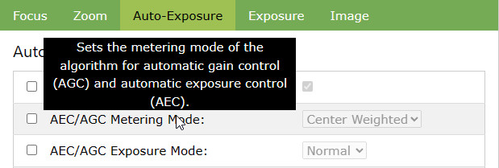
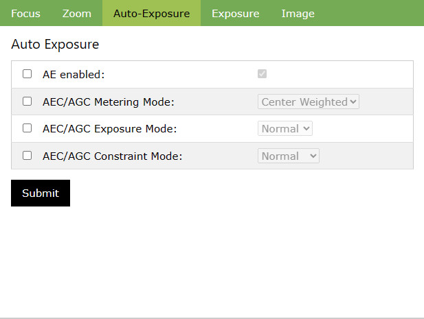
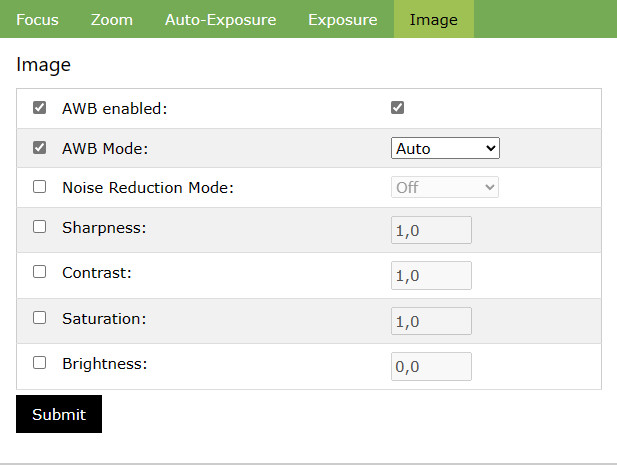

# raspiCamSrv Camera Controls

Picamera2 allows for a set of 36 camera control parameters which can be adjusted while the camera is active.   
From these, 8 parameters are just part of the image metadata and cannot be applied to the camera.

In principle, the remaining 28 parameters can be applied to the camera at different times
1. As part of the [Camera Configuration](./Configuration.md).    
Here **raspiCamSrv** supports adding any of these parameters to the configuration.   
Control parameters included in the configuration have precedence over parameters not in the configuration.
2. After camera configuration before camera start.   
In **raspiCamSrv**, this applies for all photos and videos taken in a raspiCamSrv session.
3. After the camera has been started.   
In **raspiCamSrv**, this is only used for the live stream shown in the upper left quarter.   
If controls have been modified and submitted, they will be directly applied to the live stream.

Modification of camera controls does not affect raw photos.

In **raspiCamSrv** all controls are explained through tooltips on the parameter name:
   
The texts for the tooltips have been mainly taken from the [Picamera2 Manual](./picamera2-manual.pdf) or the 
underlying [libcamera documentation](https://libcamera.org/api-html/index.html).

The controls are grouped into
- [Focus Handling](./FocusHandling.md)
- [Zoom & Pan](./ZoomPan.md)
- [Auto-Exposure](#auto-exposure)
- [Exposure](#exposure)
- [Image](#image)

## Basics
All Control Parameter tabs (except Zoom and Pan) are structured similarly:
- Every tab is a form. This means that all parameters shown can be modified without any effect.   
Only when the form is submitted through the **Submit** button, the settings are saved in the server configuration and directly applied to the live stream.
- Every parameter has a preceeding checkbox by which allows activation/deactivation of the control parameter within the configuration.   
Only if the checkbox is checked, the parameter can be modified.   
If the checkbox is unchecked, the control is not effective independently from its value.
- Individual parameters may have restictions either as distinct values or ranges of allowed values.   
It should normally not be possible to enter a value which will not be accepted by the camera.
- Some camera systems support only a subset of the available control parameters.   
For example cameras 1 and 2 have no focus management.   
This is recognized by **rapiCamSrv** and these parameters will not presented to the user.
- All forms for the different parameter groups on different tabs are part of the same web page.   
If values are modified without submitting, the modification will be visible even if another tab has been selected in the meantime.   
**If modifications are not submitted on their own tab, they will be lost in the next request/response cycle which can be triggered by a submit on another tab**.

## Auto-Exposure

This tab includes parameters which control the Auto Exposure (AE) algorithm of the camera.

## Exposure

This tab includes parameters related to exposure control.

## Image

This tab includes parameters controlling the image appearance